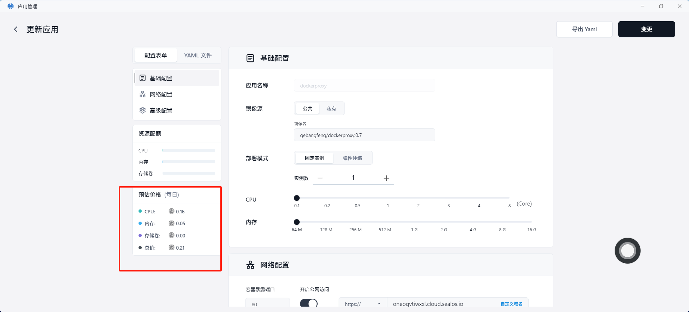

<div align="center">

# docker-proxy

[](https://github.com/kubesre)
[](https://github.com/kubesre/docker-registry-mirrors/graphs/contributors)
[](https://github.com/kubesre/docker-registry-mirrors/issues)
[](https://github.com/kubesre/docker-registry-mirrors/pulls)
[](https://github.com/kubesre/docker-registry-mirrors/stargazers)
[](https://github.com/kubesre/docker-registry-mirrors)
[](https://github.com/kubesre/docker-registry-mirrors/blob/main/LICENSE)

<p> 使用 sealos 快速部署自建的Docker镜像加速服务.</p>

</div>


## 📦 部署
**1. 登入 [Sealos](https://cloud.sealos.io/)**

**2. 区域选择(新加坡),然后点击`应用管理`>`新建应用`**
<table>
    <tr>
        <td width="50%" align="center"></td>
    </tr>
</table>
<table>
    <tr>
        <td width="50%" align="center"></td>
    </tr>
</table>

**3. 填写要给应用名称（随意填写），输入镜像源`gebangfeng/dockerproxy:0.7` cpu和内存拉到最低**
  

<table>
    <tr>
        <td width="50%" align="center"></td>
    </tr>
</table>

**4. 网络配置这块，选择公开，并复制好随机分配的域名,后面拉取镜像用的**

<table>
    <tr>
        <td width="50%" align="center"></td>
    </tr>
</table>

**5. 其他不用管，点部署应用即可**
<table>
    <tr>
        <td width="50%" align="center"></td>
    </tr>
</table>
<table>
    <tr>
        <td width="50%" align="center"></td>
    </tr>
</table>

**6. 等待服务`running`，并观察下日志，有日志输出一般就可以了**
<table>
    <tr>
        <td width="50%" align="center"></td>
    </tr>
</table>
<table>
    <tr>
        <td width="50%" align="center"></td>
    </tr>
</table>

## ✨ 使用

**1. 使用Sealos分配的服务地址，增加前缀的方式拉取镜像(以下只是举例，实际支持所有常用仓库)**

```shell
# docker hub Registry
## 源：nginx:alpine
## 替换
docker pull your_render_url/docker.io/nginx:alpine

# quay.io
## 源：quay.io/argoproj/argocd:v2.11.0
## 替换
docker pull your_render_url/quay.io/argoproj/argocd:v2.11.0
```

**3. 拉取速度测试，效果还是可以的，主要是免费**


## ⚠️ 费用方面
**1.** cpu和内存费用



**2.** 网络费用


## 感谢以下项目的付出

- [crproxy](https://github.com/wzshiming/crproxy/tree/master/examples/default)
- [Docker-Proxy](https://github.com/dqzboy/Docker-Proxy)